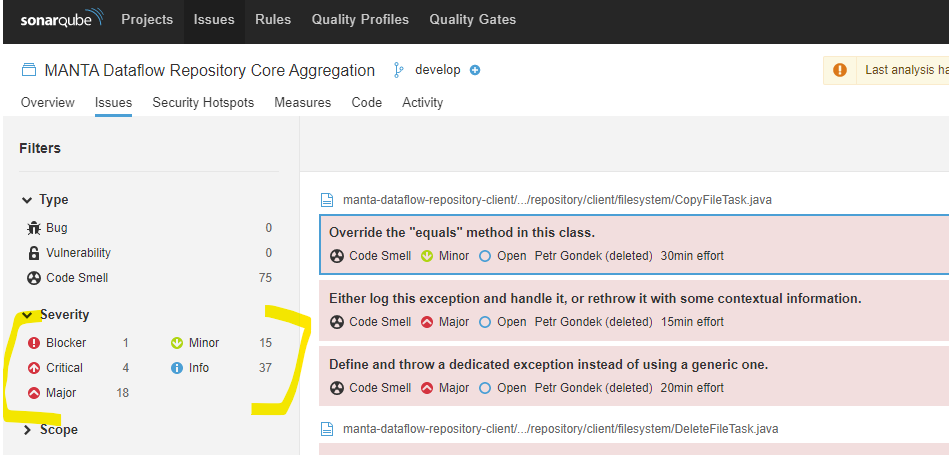
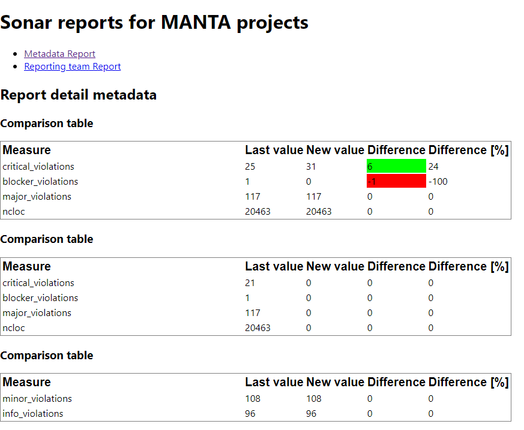

# Sonar Report Assignment

## Task 1 - Reports Reducer
There's a `filterMeasures` helper function in `src/reports/reducers/reportsReducer.ts`.
* Implement its body according to its input and output type definition.
* Verify its functionality by test `src/reports/reducers/reportsReducerHelpers.test.ts`

Description: The method takes an object of measures and its values and an array of measures that we want to filter. The output should be an array of objects containing measure and its value.

## Task 2 - Reports Reducer Full solution
With use of `filterMeasures`, implement the whole reducer that converts data from API format into the format required by the comparison tables

## Task 3 - Add a Button that reloads data from server
* Add a button in `src/reports/ReportDetailPage.tsx`
* Add a click action - reuse the action for requesting report data.

## Task 4 - What would be necessary to convert this functional component to a class component?
You can implement or explain verbally

## Task 5 - React router DOM understanding
In `src/index.tsx`, there is a routing defined containing a nested route
* Can you explain, what nested route is? What components are nested and how the nested page is added in the parent component?
* The route uses a ":id" parameter. Can you show and explain, what mechanism allows the component to access this route parameter? 

## Task 6 - Code review
Do the code review for `src/reports/ReportDetailPage.tsx`
* What could be improved, suggest changes

# What the application does:
* The application collects measures for each component (here `manta-dataflow-core`).
* The data are collected for each week (in data, there are data for time periods `week-1`, `week-2` and `week-3`.)
* The report defines comparison tables:
  * what time periods it compares
  * what measures it displays
* The example data from API can be found in `src/reports/sagas/reportSagas.ts` in `apiData` constant.

### SonarQube source

### Application comparison table output
